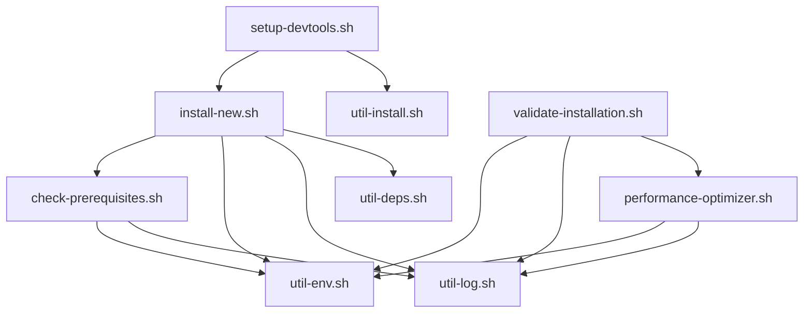

# Ubuntu Development Environment - Developer Documentation

## Table of Contents

- [Architecture Overview](#architecture-overview)
- [Code Structure](#code-structure)
- [Development Guidelines](#development-guidelines)
- [Testing Framework](#testing-framework)
- [Performance Optimization](#performance-optimization)
- [Security Implementation](#security-implementation)
- [CI/CD Integration](#cicd-integration)
- [Contributing Guidelines](#contributing-guidelines)

## Architecture Overview

### Design Principles

The Ubuntu Development Environment follows these core design principles:

1. **Modularity**: Each component is independently installable and configurable
2. **Environment Awareness**: Automatic detection and optimization for WSL2, Desktop, and Headless environments
3. **Idempotency**: Safe to run multiple times without side effects
4. **Performance**: Intelligent caching and parallel processing
5. **Security**: Security-first approach with comprehensive validation
6. **Maintainability**: Clean, well-documented, and testable code

### System Architecture

```
┌─────────────────────────────────────────────────────────────┐
│                     Ubuntu Dev Environment                  │
├─────────────────────────────────────────────────────────────┤
│  ┌─────────────────┐  ┌─────────────────┐  ┌──────────────┐ │
│  │   Core Scripts  │  │   Utilities     │  │  Components  │ │
│  │  - install-new  │  │  - util-log     │  │  - Node.js   │ │
│  │  - validate     │  │  - util-env     │  │  - Python    │ │
│  │  - check-prereq │  │  - util-deps    │  │  - Docker    │ │
│  └─────────────────┘  └─────────────────┘  └──────────────┘ │
├─────────────────────────────────────────────────────────────┤
│  ┌─────────────────┐  ┌─────────────────┐  ┌──────────────┐ │
│  │   Environment   │  │   Performance   │  │   Security   │ │
│  │   Detection     │  │   Optimization  │  │  Validation  │ │
│  └─────────────────┘  └─────────────────┘  └──────────────┘ │
├─────────────────────────────────────────────────────────────┤
│  ┌─────────────────┐  ┌─────────────────┐  ┌──────────────┐ │
│  │     Testing     │  │     Logging     │  │     Cache    │ │
│  │   Framework     │  │    System       │  │  Management  │ │
│  └─────────────────┘  └─────────────────┘  └──────────────┘ │
└─────────────────────────────────────────────────────────────┘
```

### Component Dependencies



## Code Structure

### Directory Layout

```
ubuntu-dev-setup/
├── core/                          # Core installation scripts
│   ├── install-new.sh            # Main installer
│   ├── check-prerequisites.sh    # Prerequisites validation
│   └── validate-installation.sh  # Installation validation
├── setup/                        # Component-specific setup
│   ├── setup-devtools.sh        # Development tools
│   ├── setup-node-python.sh     # Language runtimes
│   ├── setup-desktop.sh         # Desktop environment
│   └── setup-terminal-enhancements.sh
├── utils/                        # Utility modules
│   ├── util-log.sh              # Logging framework
│   ├── util-env.sh              # Environment detection
│   ├── util-deps.sh             # Dependency management
│   ├── util-install.sh          # Installation helpers
│   └── util-versions.sh         # Version management
├── config/                       # Configuration files
│   ├── dependencies.yaml        # Package dependencies
│   ├── docker-pull-config.yaml  # Docker configuration
│   └── environment.conf.example # Environment template
├── tests/                        # Test suite
│   ├── comprehensive-test-suite.bats
│   ├── unit/                    # Unit tests
│   ├── integration/             # Integration tests
│   └── fixtures/                # Test fixtures
├── docs/                        # Documentation
│   ├── user-guide.md           # User documentation
│   ├── developer-guide.md      # This file
│   └── api/                    # API documentation
├── tools/                       # Development tools
│   ├── performance-optimizer.sh # Performance optimization
│   ├── compliance-check.sh     # Code compliance
│   └── security-scanner.sh     # Security validation
└── .github/                     # GitHub configuration
    ├── workflows/               # CI/CD workflows
    ├── copilot-instructions.md  # Copilot guidelines
    └── CONTRIBUTING.md          # Contribution guidelines
```

### Core Modules

#### util-log.sh

**Purpose**: Centralized logging framework with structured output

**Key Functions**:

- `init_logging()` - Initialize logging subsystem
- `log_info()`, `log_warn()`, `log_error()` - Structured logging
- `log_performance()` - Performance metrics logging
- `flush_log_buffer()` - Asynchronous log writing

**Features**:

- Multiple output formats (console, file, syslog)
- Log level filtering
- Performance metrics integration
- Buffer management for high-throughput scenarios

#### util-env.sh

**Purpose**: Environment detection and system information

**Key Functions**:

- `detect_environment()` - Detect WSL2/Desktop/Headless
- `get_system_info()` - Comprehensive system information
- `is_wsl()`, `is_desktop()`, `is_headless()` - Environment checks
- `get_performance_profile()` - Performance characteristics

**Features**:

- Automatic environment detection
- Performance profiling
- Resource monitoring
- Cross-platform compatibility

#### util-deps.sh

**Purpose**: Dependency management and package operations

**Key Functions**:

- `install_package()` - Universal package installation
- `check_dependency()` - Dependency validation
- `resolve_conflicts()` - Package conflict resolution
- `cache_package_list()` - Package list caching

**Features**:

- Multi-package-manager support (apt, snap, pip, npm)
- Intelligent caching
- Conflict resolution
- Progress tracking

### Script Standards

#### File Structure Template

Every script should follow this structure:

```bash
#!/usr/bin/env bash
# script-name.sh - Brief description
# Version: X.Y.Z
# Last updated: YYYY-MM-DD

set -euo pipefail

readonly SCRIPT_DIR="$(cd "$(dirname "${BASH_SOURCE[0]}")" && pwd)"
readonly VERSION="X.Y.Z"
readonly DRY_RUN="${DRY_RUN:-false}"

# OS Detection for cross-platform support
readonly OS_TYPE="$(uname -s)"

# Source utilities with error checking
for util in "util-log.sh" "util-env.sh"; do
    util_path="$SCRIPT_DIR/$util"
    if [[ -f "$util_path" ]]; then
        source "$util_path" || { echo "Failed to source $util"; exit 1; }
    fi
done

# Initialize logging if available
if declare -f init_logging >/dev/null 2>&1; then
    init_logging
fi

# Main functionality
main() {
    log_info "Starting $0 v$VERSION"
    
    # Implementation here
    
    log_success "Completed successfully"
}

# Script execution
if [[ "${BASH_SOURCE[0]}" == "${0}" ]]; then
    main "$@"
fi
```

#### Function Standards

```bash
# Function documentation template
# Description: Brief function description
# Arguments: 
#   $1 - First argument description
#   $2 - Second argument description
# Returns: Return value description
# Globals: Global variables used/modified
function_name() {
    local arg1="$1"
    local arg2="${2:-default_value}"
    
    # Input validation
    if [[ -z "$arg1" ]]; then
        log_error "Missing required argument: arg1"
        return 1
    fi
    
    # Implementation
    log_info "Processing $arg1..."
    
    # Error handling with context
    if ! some_operation "$arg1"; then
        log_error "Failed to process $arg1"
        return 1
    fi
    
    # Success
    log_success "Successfully processed $arg1"
    return 0
}
```

#### Variable Naming Conventions

```bash
# Constants (readonly)
readonly GLOBAL_CONSTANT="value"
readonly MAX_RETRIES=3

# Configuration variables
CONFIG_FILE="path/to/config"
DEFAULT_TIMEOUT=30

# Local variables (use 'local' in functions)
local temp_file
local exit_code=0

# Environment variables
export DEVELOPMENT_MODE=true
export LOG_LEVEL="info"
```

## Development Guidelines

### Coding Standards

#### Shell Script Guidelines

1. **Strict Mode**: Always use `set -euo pipefail`
2. **Quoting**: Quote all variable expansions: `"$variable"`
3. **Error Handling**: Check return codes and provide meaningful errors
4. **Functions**: Use functions for reusable code blocks
5. **Comments**: Document complex logic and business requirements

#### Performance Guidelines

1. **Caching**: Cache expensive operations
2. **Parallel Processing**: Use background processes where appropriate
3. **Resource Management**: Clean up temporary resources
4. **Memory Efficiency**: Use streams for large data processing

#### Security Guidelines

1. **Input Validation**: Validate and sanitize all inputs
2. **Privilege Management**: Minimize use of sudo
3. **Path Security**: Validate file paths before use
4. **Temporary Files**: Use `mktemp` for temporary file creation

### Environment Variables

#### Development Environment Variables

```bash
# Development mode settings
export DEVELOPMENT_MODE=true        # Enable development features
export DEBUG=false                  # Enable debug output
export VERBOSE=false               # Enable verbose logging

# Performance settings
export CACHE_ENABLED=true          # Enable caching
export MAX_PARALLEL_JOBS=4         # Parallel processing limit
export PERFORMANCE_MODE="balanced" # Performance optimization level

# Testing settings
export TEST_MODE=false             # Enable test mode
export MOCK_EXTERNAL_SERVICES=false # Mock external dependencies
export TEST_DATA_DIR="/tmp/test"   # Test data directory
```

#### Production Environment Variables

```bash
# Production mode settings
export PRODUCTION_MODE=true        # Enable production optimizations
export LOG_LEVEL="info"           # Production logging level
export MONITORING_ENABLED=true    # Enable monitoring

# Security settings
export SECURITY_SCAN_ENABLED=true # Enable security scanning
export ENFORCE_TLS=true           # Enforce TLS for downloads
export VALIDATE_SIGNATURES=true  # Validate package signatures

# Performance settings
export CACHE_TTL=3600            # Cache time-to-live
export CONNECTION_TIMEOUT=30     # Network operation timeout
export MAX_RETRIES=3             # Maximum retry attempts
```

### Development Workflow

#### Local Development Setup

1. **Clone Repository**:

   ```bash
   git clone https://github.com/your-org/ubuntu-dev-setup.git
   cd ubuntu-dev-setup
   ```

2. **Development Environment**:

   ```bash
   # Set up development environment
   export DEVELOPMENT_MODE=true
   export DEBUG=true
   
   # Install development dependencies
   ./dev-tools/setup-dev-environment.sh
   ```

3. **Code Quality Checks**:

   ```bash
   # Run linting
   ./tools/lint.sh
   
   # Run compliance checks
   ./simple-compliance-check.sh
   
   # Run security scan
   ./tools/security-scan.sh
   ```

#### Testing Workflow

1. **Unit Tests**:

   ```bash
   # Run unit tests
   bats tests/unit/
   
   # Run specific test file
   bats tests/unit/test-util-log.bats
   ```

2. **Integration Tests**:

   ```bash
   # Run integration tests
   bats tests/integration/
   
   # Run with different environments
   FORCE_ENVIRONMENT=wsl bats tests/integration/
   ```

3. **Comprehensive Test Suite**:

   ```bash
   # Run full test suite
   bats tests/comprehensive-test-suite.bats
   
   # Generate test report
   bats --formatter junit tests/ > test-results.xml
   ```

#### Code Review Process

1. **Pre-Review Checklist**:
   - [ ] All tests pass
   - [ ] Code follows style guidelines
   - [ ] Documentation updated
   - [ ] Security review completed
   - [ ] Performance impact assessed

2. **Review Guidelines**:
   - Check for security vulnerabilities
   - Verify error handling
   - Assess performance impact
   - Validate test coverage
   - Review documentation

3. **Approval Process**:
   - Automated checks must pass
   - At least one maintainer approval
   - Security review for security-related changes
   - Performance review for performance-critical changes

## Testing Framework

### Test Architecture

The testing framework is built on Bats (Bash Automated Testing System) with custom extensions for project-specific testing needs.

```
tests/
├── comprehensive-test-suite.bats  # Main test suite
├── unit/                         # Unit tests
│   ├── test-util-log.bats       # Logging framework tests
│   ├── test-util-env.bats       # Environment detection tests
│   └── test-util-deps.bats      # Dependency management tests
├── integration/                  # Integration tests
│   ├── test-installation.bats   # Installation workflow tests
│   ├── test-environment.bats    # Environment-specific tests
│   └── test-components.bats     # Component interaction tests
├── performance/                  # Performance tests
│   ├── test-caching.bats       # Cache performance tests
│   ├── test-parallel.bats      # Parallel processing tests
│   └── test-memory.bats        # Memory usage tests
├── security/                    # Security tests
│   ├── test-input-validation.bats
│   ├── test-permissions.bats
│   └── test-vulnerabilities.bats
└── fixtures/                   # Test data and fixtures
    ├── mock-systems/           # Mock system environments
    ├── test-data/              # Test input data
    └── expected-outputs/       # Expected test outputs
```

### Test Categories

#### Unit Tests

Test individual functions and modules in isolation:

```bash
@test "util-log: should format log messages correctly" {
    source util-log.sh
    
    run log_info "Test message"
    [ "$status" -eq 0 ]
    [[ "$output" =~ \[INFO\].*Test\ message ]]
}
```

#### Integration Tests

Test component interactions and workflows:

```bash
@test "installation: should install Node.js and Python together" {
    run ./install-new.sh --components="nodejs,python" --dry-run
    [ "$status" -eq 0 ]
    [[ "$output" =~ "Node.js" ]]
    [[ "$output" =~ "Python" ]]
}
```

#### Performance Tests

Validate performance characteristics:

```bash
@test "performance: installation should complete within time limit" {
    start_time=$(date +%s)
    run ./install-new.sh --all --dry-run
    end_time=$(date +%s)
    
    duration=$((end_time - start_time))
    [ "$duration" -le 300 ]  # 5 minutes max
}
```

#### Security Tests

Validate security controls:

```bash
@test "security: should validate input parameters" {
    run ./install-new.sh --components="../../../etc/passwd"
    [ "$status" -ne 0 ]
    [[ "$output" =~ "Invalid component" ]]
}
```

### Running Tests

#### Local Testing

```bash
# Install Bats
sudo apt-get install bats

# Run all tests
bats tests/

# Run specific test category
bats tests/unit/
bats tests/integration/
bats tests/performance/
bats tests/security/

# Run with verbose output
bats --verbose tests/

# Generate test report
bats --formatter junit tests/ > test-results.xml
```

#### CI/CD Testing

```bash
# Docker-based testing
docker run --rm -v "$(pwd):/code" ubuntu:22.04 bash -c "
    cd /code
    apt-get update && apt-get install -y bats
    bats tests/
"

# Multi-environment testing
for env in wsl desktop headless; do
    FORCE_ENVIRONMENT=$env bats tests/integration/
done
```

### Test Data Management

#### Mock Environments

Create controlled test environments:

```bash
# Create mock WSL environment
setup_mock_wsl() {
    export FORCE_ENVIRONMENT="wsl"
    export WSL_DISTRO_NAME="Ubuntu-22.04"
    mkdir -p /mnt/c/Windows
}

# Create mock desktop environment
setup_mock_desktop() {
    export FORCE_ENVIRONMENT="desktop"
    export DISPLAY=":0"
    export XDG_CURRENT_DESKTOP="GNOME"
}
```

#### Test Fixtures

Provide consistent test data:

```bash
# Load test configuration
load_test_config() {
    export TEST_CONFIG_FILE="tests/fixtures/test-config.yaml"
    export TEST_DATA_DIR="tests/fixtures/test-data"
}

# Create temporary test environment
setup_test_environment() {
    export TEST_TEMP_DIR="$(mktemp -d)"
    export HOME="$TEST_TEMP_DIR/home"
    mkdir -p "$HOME"
}
```

## Performance Optimization

### Caching Strategy

#### Cache Architecture

The caching system provides multiple layers of optimization:

1. **System Information Cache**: OS details, hardware specs
2. **Package List Cache**: Available packages and versions  
3. **Download Cache**: Downloaded files and installers
4. **Validation Cache**: Previously validated components

#### Cache Implementation

```bash
# Cache management in performance-optimizer.sh
setup_cache_infrastructure() {
    local cache_dir="$HOME/.cache/ubuntu-dev-tools"
    mkdir -p "$cache_dir"/{downloads,package-lists,system-info,validation}
    
    # Create cache metadata
    cat > "$cache_dir/cache-info.json" << EOF
{
    "version": "1.0.0",
    "created": "$(date -Iseconds)",
    "ttl": 3600
}
EOF
}

# Intelligent cache key generation
generate_cache_key() {
    local operation="$1"
    local params="$2"
    local system_hash="$(uname -r):$(whoami):$(date +%Y%m%d)"
    
    echo "$operation:$params:$(echo "$system_hash" | sha256sum | cut -d' ' -f1)"
}
```

#### Cache Usage

```bash
# Use cached data when available
with_cache() {
    local cache_key="$1"
    local ttl="$2"
    local operation="$3"
    
    local cache_file="$CACHE_DIR/$cache_key"
    
    # Check cache validity
    if [[ -f "$cache_file" ]] && [[ $(($(date +%s) - $(stat -c %Y "$cache_file"))) -lt $ttl ]]; then
        cat "$cache_file"
        return 0
    fi
    
    # Generate and cache result
    local result
    result=$($operation)
    echo "$result" > "$cache_file"
    echo "$result"
}
```

### Parallel Processing

#### Parallel Installation

```bash
# Parallel component installation
install_components_parallel() {
    local components=("$@")
    local pids=()
    local max_jobs=4
    
    for component in "${components[@]}"; do
        # Wait if we've reached max parallel jobs
        if [[ ${#pids[@]} -ge $max_jobs ]]; then
            wait "${pids[0]}"
            pids=("${pids[@]:1}")
        fi
        
        # Start component installation in background
        (
            install_component "$component"
        ) &
        pids+=($!)
    done
    
    # Wait for all remaining jobs
    for pid in "${pids[@]}"; do
        wait "$pid"
    done
}
```

#### Resource Management

```bash
# Monitor system resources during parallel execution
monitor_system_resources() {
    local cpu_threshold=80
    local memory_threshold=80
    
    while true; do
        local cpu_usage=$(top -bn1 | grep "Cpu(s)" | awk '{print $2}' | cut -d'%' -f1)
        local memory_usage=$(free | awk '/^Mem:/ {printf "%.0f", $3/$2 * 100}')
        
        if [[ $(echo "$cpu_usage > $cpu_threshold" | bc -l) -eq 1 ]]; then
            log_warn "High CPU usage: $cpu_usage%"
            # Implement throttling
        fi
        
        if [[ $memory_usage -gt $memory_threshold ]]; then
            log_warn "High memory usage: $memory_usage%"
            # Implement memory management
        fi
        
        sleep 5
    done
}
```

### Performance Monitoring

#### Metrics Collection

```bash
# Collect performance metrics
collect_performance_metrics() {
    local operation="$1"
    local start_time=$(date +%s.%N)
    
    # Execute operation
    "$@"
    local exit_code=$?
    
    local end_time=$(date +%s.%N)
    local duration=$(echo "$end_time - $start_time" | bc -l)
    
    # Record metrics
    record_performance_metric "$operation" "$duration" "$exit_code"
    
    return $exit_code
}

# Store metrics for analysis
record_performance_metric() {
    local operation="$1"
    local duration="$2"
    local exit_code="$3"
    
    local metrics_file="$HOME/.local/share/ubuntu-dev-tools/metrics.json"
    
    # Update metrics file
    jq --arg op "$operation" \
       --arg dur "$duration" \
       --arg code "$exit_code" \
       --arg time "$(date -Iseconds)" \
       '.metrics += [{
           "operation": $op,
           "duration": ($dur | tonumber),
           "exit_code": ($code | tonumber),
           "timestamp": $time
       }]' "$metrics_file" > "$metrics_file.tmp" && mv "$metrics_file.tmp" "$metrics_file"
}
```

#### Performance Dashboard

The performance optimizer generates HTML dashboards for monitoring:

```bash
# Generate performance dashboard
generate_performance_dashboard() {
    local dashboard_file="$HOME/.cache/ubuntu-dev-tools/dashboard.html"
    
    # Generate HTML with performance data
    # Implementation in performance-optimizer.sh
}
```

## Security Implementation

### Security Framework

#### Input Validation

```bash
# Validate input parameters
validate_input() {
    local input="$1"
    local type="${2:-string}"
    
    case "$type" in
        "component")
            if [[ ! "$input" =~ ^[a-zA-Z0-9_-]+$ ]]; then
                log_error "Invalid component name: $input"
                return 1
            fi
            ;;
        "path")
            # Prevent path traversal
            if [[ "$input" =~ \.\./|^/ ]]; then
                log_error "Invalid path: $input"
                return 1
            fi
            ;;
        "version")
            if [[ ! "$input" =~ ^[0-9]+\.[0-9]+(\.[0-9]+)?$ ]]; then
                log_error "Invalid version format: $input"
                return 1
            fi
            ;;
    esac
    
    return 0
}
```

#### Secure Downloads

```bash
# Secure download with validation
secure_download() {
    local url="$1"
    local output_file="$2"
    local expected_hash="${3:-}"
    
    # Validate URL
    if [[ ! "$url" =~ ^https:// ]]; then
        log_error "Only HTTPS URLs allowed: $url"
        return 1
    fi
    
    # Download with timeout and validation
    if ! curl --fail --silent --show-error \
              --max-time 300 \
              --location \
              --output "$output_file" \
              "$url"; then
        log_error "Failed to download: $url"
        return 1
    fi
    
    # Verify hash if provided
    if [[ -n "$expected_hash" ]]; then
        local actual_hash
        actual_hash=$(sha256sum "$output_file" | cut -d' ' -f1)
        if [[ "$actual_hash" != "$expected_hash" ]]; then
            log_error "Hash verification failed for: $output_file"
            rm -f "$output_file"
            return 1
        fi
    fi
    
    return 0
}
```

#### Permission Management

```bash
# Set secure file permissions
set_secure_permissions() {
    local file_path="$1"
    local file_type="${2:-file}"
    
    case "$file_type" in
        "file")
            chmod 644 "$file_path"
            ;;
        "executable")
            chmod 755 "$file_path"
            ;;
        "private")
            chmod 600 "$file_path"
            ;;
        "directory")
            chmod 755 "$file_path"
            ;;
    esac
    
    # Ensure proper ownership
    if [[ "$(stat -c %U "$file_path")" != "$(whoami)" ]]; then
        log_warn "File ownership mismatch: $file_path"
    fi
}
```

### Security Scanning

#### Vulnerability Assessment

```bash
# Scan for security vulnerabilities
security_scan() {
    local scan_type="${1:-basic}"
    local scan_results=()
    
    case "$scan_type" in
        "basic")
            scan_results+=($(scan_file_permissions))
            scan_results+=($(scan_network_exposure))
            ;;
        "comprehensive")
            scan_results+=($(scan_file_permissions))
            scan_results+=($(scan_network_exposure))
            scan_results+=($(scan_package_vulnerabilities))
            scan_results+=($(scan_configuration_security))
            ;;
    esac
    
    # Generate security report
    generate_security_report "${scan_results[@]}"
}
```

#### Configuration Validation

```bash
# Validate security configuration
validate_security_config() {
    local config_file="$1"
    local validation_errors=0
    
    # Check SSH configuration
    if [[ -f "$HOME/.ssh/config" ]]; then
        if grep -q "PasswordAuthentication yes" "$HOME/.ssh/config"; then
            log_warn "SSH password authentication enabled"
            ((validation_errors++))
        fi
    fi
    
    # Check Docker security
    if command -v docker >/dev/null 2>&1; then
        if docker info 2>/dev/null | grep -q "Security Options: none"; then
            log_warn "Docker security options not configured"
            ((validation_errors++))
        fi
    fi
    
    return $validation_errors
}
```

## CI/CD Integration

### GitHub Actions Workflows

#### Main Workflow

```yaml
# .github/workflows/ci.yml
name: Continuous Integration

on:
  push:
    branches: [ main, develop ]
  pull_request:
    branches: [ main ]

jobs:
  lint:
    runs-on: ubuntu-latest
    steps:
      - uses: actions/checkout@v4
      - name: Install shellcheck
        run: sudo apt-get install -y shellcheck
      - name: Run shellcheck
        run: find . -name "*.sh" -exec shellcheck {} \;

  compliance:
    runs-on: ubuntu-latest
    steps:
      - uses: actions/checkout@v4
      - name: Run compliance check
        run: |
          chmod +x simple-compliance-check.sh
          ./simple-compliance-check.sh

  test:
    runs-on: ubuntu-latest
    strategy:
      matrix:
        ubuntu-version: ['20.04', '22.04', '24.04']
        environment: ['wsl', 'desktop', 'headless']
    steps:
      - uses: actions/checkout@v4
      - name: Install bats
        run: sudo apt-get install -y bats
      - name: Run tests
        env:
          FORCE_ENVIRONMENT: ${{ matrix.environment }}
        run: bats tests/

  security:
    runs-on: ubuntu-latest
    steps:
      - uses: actions/checkout@v4
      - name: Security scan
        run: |
          # Run security scanning
          ./tools/security-scan.sh

  performance:
    runs-on: ubuntu-latest
    steps:
      - uses: actions/checkout@v4
      - name: Performance benchmark
        run: |
          # Run performance tests
          ./performance-optimizer.sh --benchmark
```

#### Release Workflow

```yaml
# .github/workflows/release.yml
name: Release

on:
  push:
    tags:
      - 'v*'

jobs:
  release:
    runs-on: ubuntu-latest
    steps:
      - uses: actions/checkout@v4
      
      - name: Generate changelog
        run: |
          # Generate changelog from commits
          ./tools/generate-changelog.sh > CHANGELOG.md
      
      - name: Create release
        uses: actions/create-release@v1
        env:
          GITHUB_TOKEN: ${{ secrets.GITHUB_TOKEN }}
        with:
          tag_name: ${{ github.ref }}
          release_name: Release ${{ github.ref }}
          body_path: CHANGELOG.md
          draft: false
          prerelease: false
```

### Quality Gates

#### Pre-commit Hooks

```bash
#!/bin/bash
# .git/hooks/pre-commit

# Run shellcheck
echo "Running shellcheck..."
if ! find . -name "*.sh" -exec shellcheck {} \; ; then
    echo "Shellcheck failed"
    exit 1
fi

# Run compliance check
echo "Running compliance check..."
if ! ./simple-compliance-check.sh >/dev/null 2>&1; then
    echo "Compliance check failed"
    exit 1
fi

# Run unit tests
echo "Running unit tests..."
if ! bats tests/unit/ >/dev/null 2>&1; then
    echo "Unit tests failed"
    exit 1
fi

echo "Pre-commit checks passed"
```

#### Code Coverage

```bash
# Generate code coverage report
generate_coverage_report() {
    local coverage_file="coverage/coverage.txt"
    mkdir -p coverage
    
    # Calculate function coverage
    local total_functions=0
    local tested_functions=0
    
    for script in *.sh; do
        if [[ -f "$script" ]]; then
            local functions
            functions=$(grep -c "^[[:space:]]*[a-zA-Z_][a-zA-Z0-9_]*[[:space:]]*(" "$script" || echo 0)
            total_functions=$((total_functions + functions))
            
            # Check if functions are tested
            local test_file="tests/unit/test-$(basename "$script" .sh).bats"
            if [[ -f "$test_file" ]]; then
                local tested
                tested=$(grep -c "@test" "$test_file" || echo 0)
                tested_functions=$((tested_functions + tested))
            fi
        fi
    done
    
    local coverage_percent=$((tested_functions * 100 / total_functions))
    echo "Total functions: $total_functions" > "$coverage_file"
    echo "Tested functions: $tested_functions" >> "$coverage_file"
    echo "Coverage: $coverage_percent%" >> "$coverage_file"
    
    echo "Coverage report generated: $coverage_file"
}
```

## Contributing Guidelines

### Development Process

1. **Fork and Clone**:

   ```bash
   git clone https://github.com/your-username/ubuntu-dev-setup.git
   cd ubuntu-dev-setup
   git remote add upstream https://github.com/original-org/ubuntu-dev-setup.git
   ```

2. **Create Feature Branch**:

   ```bash
   git checkout -b feature/your-feature-name
   ```

3. **Development**:
   - Follow coding standards
   - Add tests for new functionality
   - Update documentation
   - Run compliance checks

4. **Testing**:

   ```bash
   # Run full test suite
   bats tests/
   
   # Run compliance check
   ./simple-compliance-check.sh
   
   # Run security scan
   ./tools/security-scan.sh
   ```

5. **Commit and Push**:

   ```bash
   git add .
   git commit -m "feat: add new feature"
   git push origin feature/your-feature-name
   ```

6. **Create Pull Request**:
   - Use PR template
   - Link related issues
   - Provide testing instructions

### Code Review Guidelines

#### Reviewer Checklist

- [ ] **Functionality**: Does the code work as intended?
- [ ] **Security**: Are there any security vulnerabilities?
- [ ] **Performance**: Will this impact performance?
- [ ] **Testing**: Are there adequate tests?
- [ ] **Documentation**: Is documentation updated?
- [ ] **Standards**: Does code follow project standards?

#### Review Process

1. **Automated Checks**: All CI checks must pass
2. **Peer Review**: At least one maintainer approval
3. **Security Review**: Required for security-related changes
4. **Documentation Review**: Required for user-facing changes

### Release Process

#### Version Numbering

Follow Semantic Versioning (SemVer):

- **Major**: Breaking changes
- **Minor**: New features (backward compatible)
- **Patch**: Bug fixes (backward compatible)

#### Release Checklist

1. **Pre-release**:
   - [ ] All tests pass
   - [ ] Documentation updated
   - [ ] Changelog generated
   - [ ] Version bumped

2. **Release**:
   - [ ] Create release tag
   - [ ] Generate release notes
   - [ ] Publish release
   - [ ] Update documentation

3. **Post-release**:
   - [ ] Monitor for issues
   - [ ] Update examples
   - [ ] Communicate changes

---

*This developer documentation is maintained by the Ubuntu Dev Setup team.*
*Last updated: 2025-06-13*
